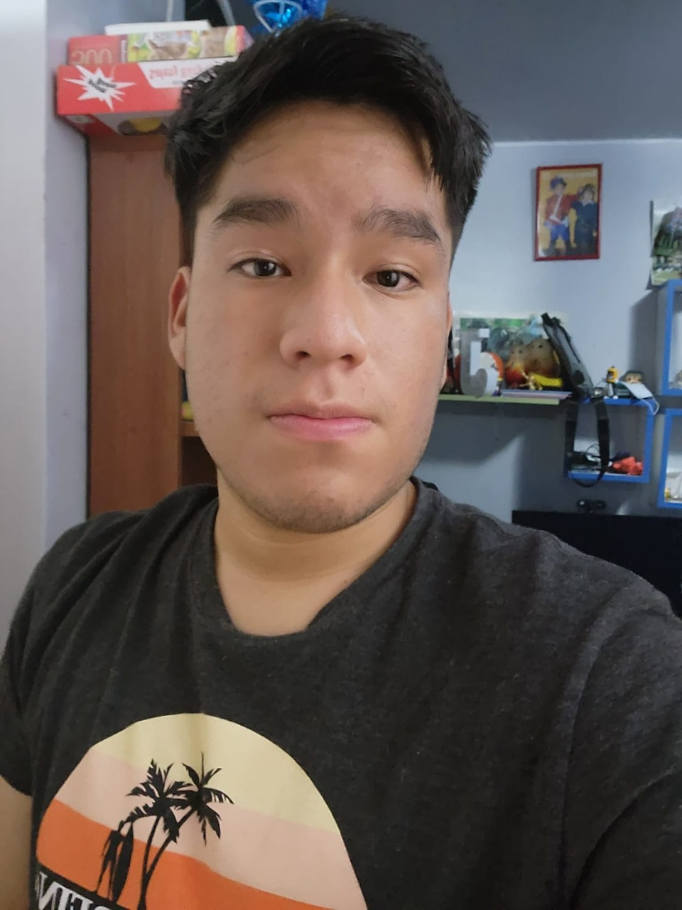
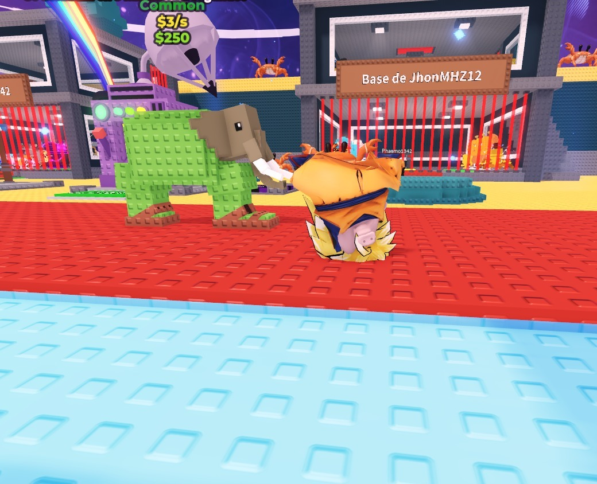

# Informe de Trabajo Final  
**Curso:** 1ASI0730 Aplicaciones Web  
**Startup:** Mythicore  
**Producto:** [Nombre del producto]  
**Integrantes:**  
- Stanley Jeremy Gutierrez Tume (U202118152) – Team Leader  
- Juan José Meza Huanacune (U202320574) – Backend Engineer  
- Eduardo Fabián Chacaliaza Minaya (U202324129) – Frontend & UX/UI Engineer
- Fabricio Fabián Quispe Barzola (U202320442) – Data & IoT Integration Engineer  

---

## Registro de Versiones del Informe
| Versión | Fecha | Autor | Descripción |
|---------|-------|-------|-------------|
| 0.1     | 2025-09-13 | Equipo Mythicore | Versión inicial del README.md con capítulos I–V |

---

## Project Report Collaboration Insights
📌 URL del repositorio: https://github.com/upc-2025-1asi0730-MithyCore/project-report
📌 Evidencia de commits y colaboración (capturas y explicación).  

---

## Contenido
1. [Student Outcome](#student-outcome)  
2. [Capítulo I: Introducción](#capítulo-i-introducción)  
3. [Capítulo II: Requirements Elicitation & Analysis](#capítulo-ii-requirements-elicitation--analysis)  
4. [Capítulo III: Requirements Specification](#capítulo-iii-requirements-specification)  
5. [Capítulo IV: Product Design](#capítulo-iv-product-design)  
6. [Capítulo V: Product Implementation, Validation & Deployment](#capítulo-v-product-implementation-validation--deployment)  
7. [Conclusiones](#conclusiones)  
8. [Bibliografía](#bibliografía)  
9. [Anexos](#anexos)  

---

# Student Outcome

El curso contribuye al cumplimiento del **ABET – EAC - Student Outcome 5**:  
*“La capacidad de funcionar efectivamente en un equipo cuyos miembros juntos proporcionan liderazgo, crean un entorno de colaboración e inclusivo, establecen objetivos, planifican tareas y cumplen objetivos.”*

En la siguiente tabla se describen las acciones realizadas y las conclusiones del equipo en relación a este Outcome.  
La información se irá ampliando en cada entrega (TB1, TP1, TB2, TF1).

| Criterio específico | Acciones realizadas | Conclusiones |
|----------------------|---------------------|--------------|
| **Trabaja en equipo para proporcionar liderazgo en forma conjunta** | **Stanley Jeremy Gutierrez Tume (U202118152)** – TB1: asumió el rol de *Team Leader*. Organizó las primeras reuniones de coordinación, asignó responsabilidades iniciales y supervisó la creación del repositorio en GitHub. Dirigió la redacción del Capítulo I y validó la versión inicial del documento.  **Juan José Meza Huanacune (U202320574)** – TB1: apoyó en la definición de GitFlow y convenciones de commits, configuró la estructura inicial del repositorio y coordinó la parte técnica de backend.   **Eduardo Fabián Chacaliaza Minaya (U202324129)** – TB1: lideró el diseño UX/UI inicial del Landing Page y colaboró en la elaboración de los perfiles de los integrantes en el Capítulo I.  **Fabricio Fabián Quispe Barzola (U202320442)** – TB1: investigó y documentó la problemática con el método 5W2H, incorporando fuentes bibliográficas y referencias actualizadas. | En TB1 logramos un liderazgo compartido y coordinado por Stanley, lo que permitió distribuir tareas de manera clara. Cada integrante asumió un área clave (liderazgo general, backend, frontend/UX, datos/IoT), y esto facilitó un inicio ordenado del proyecto. |
| **Crea un entorno colaborativo e inclusivo, establece metas, planifica tareas y cumple objetivos** | **Stanley Jeremy Gutierrez Tume (U202118152)** – TB1: estableció las metas iniciales del sprint, promovió la participación de todos y organizó un cronograma de entregables.   **Juan José Meza Huanacune (U202320574)** – TB1: coordinó la creación de issues en GitHub, facilitó la organización del backlog inicial y propuso lineamientos técnicos de backend.   **Eduardo Fabián Chacaliaza Minaya (U202324129)** – TB1: definió criterios visuales iniciales y aportó en la planificación del Sprint 1, cuidando la consistencia de diseño.   **Fabricio Fabián Quispe Barzola (U202320442)** – TB1: colaboró en la construcción del backlog inicial y propuso herramientas colaborativas para documentación y entrevistas. | En TB1 se generó un entorno inclusivo donde todos los miembros pudieron aportar sus habilidades. Se alcanzaron los objetivos iniciales: creación del repositorio, organización del flujo de trabajo, redacción del Capítulo I y definición del problema con sustento bibliográfico. Esto establece una base sólida para la colaboración en los próximos sprints. |

---

# Capítulo I: Introducción

## 1.1 Startup Profile

### 1.1.1 Descripción de la startup
**Mythicore** es una plataforma digital para atención neurológica que integra dispositivos IoT y analítica de IA.  
Su propósito es mejorar el diagnóstico temprano, monitorear en tiempo real a pacientes con enfermedades crónicas y facilitar la telemedicina mediante datos objetivos, reduciendo hospitalizaciones y optimizando la calidad de vida.

- **Misión**  
Brindar atención neurológica personalizada mediante IoT e inteligencia artificial, mejorando el diagnóstico, el seguimiento y la prevención de crisis en pacientes.  

- **Visión**  
Convertirse en la plataforma líder en salud neurológica digital, integrando monitoreo continuo y telemedicina segura a nivel global.  

### 1.1.2 Perfiles de integrantes del equipo

| Foto | Nombre y Código | Rol | Descripción |
|------|-----------------|-----|-------------|
|  | **Stanley Jeremy Gutierrez Tume (U202118152)** | **Team Leader** | Estudiante de Ingeniería de Software, asume el rol de *Team Leader*. Su enfoque colaborativo le permite asignar tareas de manera eficiente, mientras que sus habilidades técnicas en HTML y CSS respaldan la capacidad para materializar ideas. Busca constantemente oportunidades de crecimiento y aprendizaje, y está comprometido con impulsar la innovación y el éxito en entornos de desarrollo de software. |
|  | **Juan José Meza Huanacune (U202320574)** | **Backend Engineer** | Estudiante de Ingeniería de Software, asume el rol de *Backend Engineer*. Tiene experiencia en arquitecturas backend con C#, Java y Python, además del manejo de bases de datos relacionales. Su capacidad de organización, liderazgo y aplicación de metodologías ágiles le permite coordinar tareas y asegurar el cumplimiento de objetivos del equipo. |
|  | **Eduardo Fabián Chacaliaza Minaya (U202324129)** | **Frontend & UX/UI Engineer** | Estudiante de Ingeniería de Software, desempeña el rol de *Frontend & UX/UI Engineer*. Domina HTML5, CSS3 y JavaScript, junto con frameworks modernos como Vue.js y React. Se especializa en diseño de interfaces accesibles y centradas en el usuario, aportando creatividad y una visión enfocada en la experiencia de usuario para lograr aplicaciones intuitivas y atractivas. |
|  | **Fabricio Fabián Quispe Barzola (U202320442)** | **Data & IoT Integration Engineer** | Estudiante de Ingeniería de Software, cumple el rol de *Data & IoT Integration Engineer*. Cuenta con conocimientos en machine learning, procesamiento de datos y analítica con Python y R, además de experiencia en la integración de dispositivos IoT. Su aporte principal es implementar soluciones inteligentes que conecten sensores y servicios en la nube, garantizando un flujo de datos seguro y en tiempo real. |

---

## 1.2 Solution Profile

### 1.2.1 Antecedentes y problemática
La atención neurológica enfrenta un problema central: la falta de herramientas que permitan un monitoreo continuo y objetivo del estado de los pacientes.  
Actualmente, los diagnósticos suelen basarse en consultas periódicas y registros dispersos, lo que provoca detecciones tardías, tratamientos poco precisos y hospitalizaciones evitables.  

**Mythicore** busca resolver esta brecha integrando IoT e inteligencia artificial para capturar y analizar datos en tiempo real, apoyando así la toma de decisiones clínicas basadas en biomarcadores y reduciendo complicaciones.  

#### 5W2H del problema
- **Who (Quiénes):** Pacientes con enfermedades neurológicas crónicas, en rehabilitación o en riesgo; neurólogos y especialistas; hospitales y aseguradoras.  
- **What (Qué):** Falta de monitoreo neurológico continuo y objetivo → diagnósticos tardíos, tratamientos poco precisos.  
- **Where (Dónde):** Clínicas, hospitales y entornos domiciliarios.  
- **When (Cuándo):** Entre citas médicas y durante crisis críticas.  
- **Why (Por qué):** Métodos actuales generan duplicidad de información, errores y falta de continuidad.  
- **How (Cómo):** Sensores portátiles conectados a la nube + IA integrados en la historia clínica digital.  
- **How much (Cuánto):**  
  - EEG continuo reduce mortalidad intrahospitalaria.  
  - Monitoreo remoto reduce 59% de hospitalizaciones.  
  - EEG portátil reduce hasta 4 días de estancia en UCI.  

---

# Capítulo II: Requirements Elicitation & Analysis

## 2.1 Competidores
- 2.1.1 Análisis competitivo  
- 2.1.2 Estrategias y tácticas frente a competidores  

## 2.2 Entrevistas
- 2.2.1 Diseño de entrevistas  
- 2.2.2 Registro de entrevistas  
- 2.2.3 Análisis de entrevistas  

## 2.3 Needfinding
- 2.3.1 User Personas  
- 2.3.2 User Task Matrix  
- 2.3.3 User Journey Mapping  
- 2.3.4 Empathy Mapping  

## 2.4 Big Picture EventStorming  

## 2.5 Ubiquitous Language  

---

# Capítulo III: Requirements Specification

## 3.1 User Stories  
## 3.2 Impact Mapping  
## 3.3 Product Backlog  

---

# Capítulo IV: Product Design

## 4.1 Style Guidelines
- 4.1.1 General Style Guidelines  
- 4.1.2 Web Style Guidelines  

## 4.2 Information Architecture
- 4.2.1 Organization Systems  
- 4.2.2 Labeling Systems  
- 4.2.3 SEO Tags and Meta Tags  
- 4.2.4 Searching Systems  
- 4.2.5 Navigation Systems  

## 4.3 Landing Page UI Design
- 4.3.1 Landing Page Wireframe  
- 4.3.2 Landing Page Mock-up  

## 4.4 Web Applications UX/UI Design
- 4.4.1 Wireframes  
- 4.4.2 Wireflow Diagrams  
- 4.4.3 Mock-ups  
- 4.4.4 User Flow Diagrams  

## 4.5 Web Applications Prototyping  

## 4.6 Domain-Driven Software Architecture
- 4.6.1 Design-Level EventStorming  
- 4.6.2 Context Diagram  
- 4.6.3 Container Diagrams  
- 4.6.4 Component Diagrams  

## 4.7 Software Object-Oriented Design
- 4.7.1 Class Diagrams  

## 4.8 Database Design
- 4.8.1 Database Diagrams  

---

# Capítulo V: Product Implementation, Validation & Deployment

## 5.1 Software Configuration Management
- 5.1.1 Development Environment Configuration  
- 5.1.2 Source Code Management  
- 5.1.3 Style Guide & Coding Conventions  
- 5.1.4 Deployment Configuration  

## 5.2 Landing Page, Services & Applications Implementation

### 5.2.1 Sprint 1
- 5.2.1.1 Sprint Planning 1  
- 5.2.1.2 Aspect Leaders and Collaborators  
- 5.2.1.3 Sprint Backlog 1  
- 5.2.1.4 Development Evidence for Sprint Review  
- 5.2.1.5 Execution Evidence for Sprint Review  
- 5.2.1.6 Services Documentation Evidence for Sprint Review  
- 5.2.1.7 Software Deployment Evidence for Sprint Review  
- 5.2.1.8 Team Collaboration Insights during Sprint  

---

# Conclusiones
(Se completará al final del Sprint 1).  

---

# Bibliografía  

- Ceribell. (2024). Evaluating the impact of point-of-care electroencephalography on length of stay in the ICU: SAFER-EEG trial sub-analysis. Neurocritical Care. [Enlace](https://link.springer.com/article/10.1007/s12028-024-02039-6)  

- Claassen, J., Hirsch, L. J., Foreman, B., Mayer, S. A., & Vespa, P. M. (2024). Utility and rationale for continuous EEG monitoring: A primer for the general intensivist. *Critical Care, 28*(1), 45. [Enlace](https://ccforum.biomedcentral.com/articles/10.1186/s13054-024-04986-0)  

- Rodriguez Ruiz, A., et al. (2025). Survey on neurological monitoring practices and clinician perspectives. *Journal of Clinical Neurophysiology, 42*(1), 56–65. [Enlace](https://www.sciencedirect.com/science/article/pii/S1052305725000266)  

- *Frontiers in Neurology*. (2023). Multimodal monitoring: Practical recommendations in neurocritical care. [Enlace](https://www.frontiersin.org/journals/neurology/articles/10.3389/fneur.2023.1135406/full)  

- Michigan Medicine. (2023). At-home monitoring cuts hospital admissions by nearly 60%. *Medical Economics*. [Enlace](https://www.medicaleconomics.com/view/at-home-monitoring-cuts-hospital-admissions-by-nearly-60-study-finds)  

- Ceribell. (2022). Reduction in length of ICU stays with point-of-care EEG. *Ceribell Press Release*. [Enlace](https://ceribell.com/press_releases/reduction-in-length-of-icu-stays)  

# Anexos
- Videos de exposición.  
- Documentos complementarios.  
